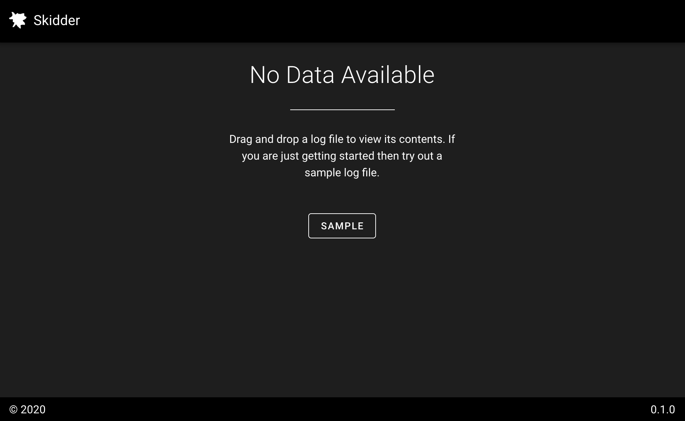
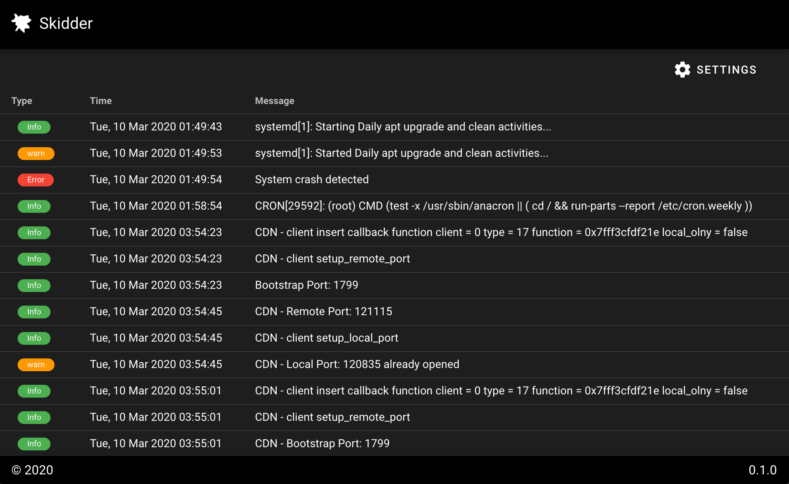
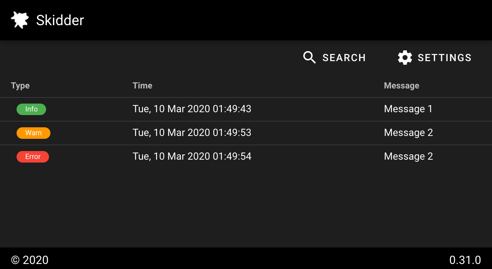

# Skidder


Skidder is an easy to use log viewer build in Vue that allows you to easily open, view, and search several types of log files. The current implementation of Skidder is a standalone web application that allows users to drag and drop a log file onto the site and view its contents. One of the future goals of the project is to provide an npm package that allows developers to easily consume the log viewer in their applications. 






## What's up with the name?
A Skidder is a tractor used for pulling logs out of the forest. Our application pulls logs out of files and displays them to the user. 

## Demo
Please click on the link below to see a demo of the site. Click the sample button if you don't have a log file readily available. 

https://mikejleighton.github.io/skidder/

## Native Log File
Skidder has been designed to work with several different types of log files but it works best with .csv files using a custom header. Here is a simple example of a log file that will work with Skidder. 

```
Type:Chip(Error-red|Warn-orange|Info-green),Time:Date,Message
Info,1583804983,Message 1
Warn,1583804993,Message 2
Error,1583804994,Message 2
```

The first line of the log file is a header that tells Skidder the column names and how to parse the rest of the file. The different types of columns supported are as follows:

**Generic** - Just specifying a column title means that the column will be treated as raw text. 

**Chip(Error-red|Warn-orange|Info-green)** - Tells Skidder that the column is an enumeration with types Error, Warn, and Info. Putting a '-red' on the end of the enum we are telling Skidder to render items of this type that color. 

**Date** - Tells Skidder that the column that its a date and time field. 

```
Info,1583804983,Message 1
Warn,1583804993,Message 2
Error,1583804994,Message 2
```

The remaining items in the log file are the actual log entries. When rendered the Skidder will display the following:



## Other Log Files
Skidder does its best to support random log files using the 'nsyslog-parser' project. If a log file is passed to Skidder that is not in the native format it will attempt to parse the file using this package and then display it to the user. For more information on this package please see

https://github.com/solzimer/nsyslog-parser

## Project setup
To build and debug this project clone this repository and perform the following steps. 

```
npm install
```

### Compiles and hot-reloads for development
```
npm run serve
```

### Compiles and minifies for production
```
npm run build
```

### Lints and fixes files
```
npm run lint
```

## Buy me a coffee
If you like this project please let me know! You can buy me a coffee here:

https://www.buymeacoffee.com/onv53zd 